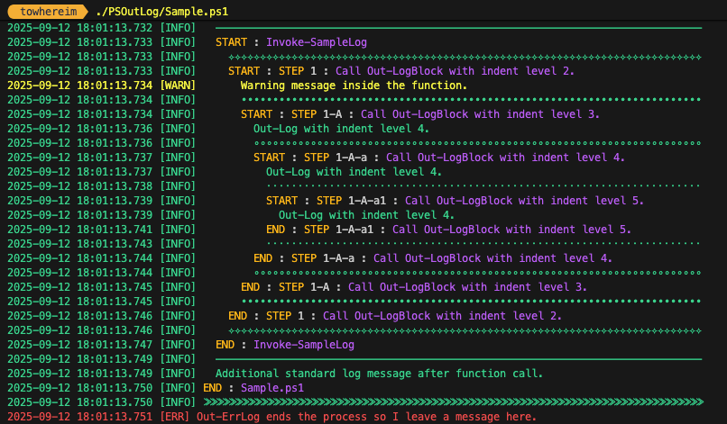

# PSOutLog

PSOutLog is a PowerShell logging module designed to provide streamlined logging functionality for your scripts. It offers functions such as Out-Log, Out-WarnLog, Out-ErrLog, and Out-LogBlock to generate log files with various log levels and styles.

- Sample.ps1


## Overview

- **Module Version**: 1.2  
- **Author**: Steve Im  
- **Company**: towhereim  
- **Description**: Logging Function for PowerShell. PSOutLog creates a log file (named <scriptname>.log) under the logs folder and highlights key events using empathic keywords such as `START`, `END`, and `STEP`.  
- **Compatible Editions**: Core, Desktop

## Features

- Simple logging mechanism with multiple log levels.
- Out-Log for standard log messages.
- Out-WarnLog for warning messages.
- Out-ErrLog for error messages.
- Out-LogBlock for logging blocks of messages.
- Automatic log file creation.
- Highlighting of empathic keywords (`START`, `END`, `STEP`).

## Installation

1. This module is registered in the PowerShell Gallery. You can install it using:
   ```powershell
   Install-Module PSOutLog
   ```
2. Import the module in your PowerShell session using:
   ```powershell
   Import-Module PSOutLog
   ```

## Usage

```powershell
Import-Module PSOutLog
# Log a standard message
Out-Log 'Script execution started'

# Log a warning message
Out-WarnLog 'This is a warning message'

# Log an error message
Out-ErrLog 'An error occurred'

# Log a block of messages
Out-LogBlock {
    "Step 1: Initialization",
    "Step 2: Processing",
    "Step 3: Completion"
}
```

## Additional Information

- **License**: [MIT License](https://github.com/towhereim/PSOutLog/LICENSE)
- **Project Repository**: [PSOutLog on GitHub](https://github.com/towhereim/PSOutLog)
- **Release Notes**:
  - v1.1
    - Out-LogBlock function added.
    - Empathic keywords highlighted (`START`, `END`, `STEP`).
  - v1.2
    - Added indent support for all logging functions to improve log readability. Now, functions such as Out-Log, Out-WarnLog, Out-ErrLog, and Out-LogBlock accept an indent level, enabling more structured and visually clear log outputs.